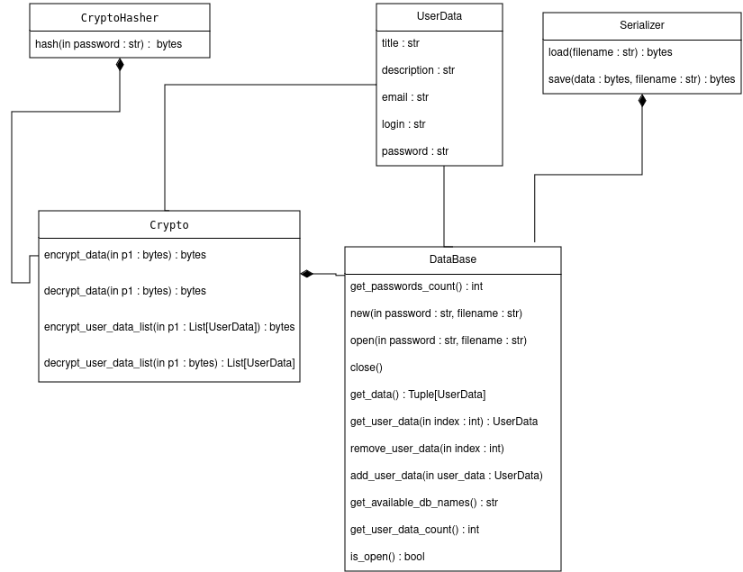

**A library for password managers.**
This is a secure and fast library that has an API in the form of a DataBase class through which you can use it.
At the moment, it can be used by both programmers and ordinary people who want to store their passwords in a safe place, as an example of a user interface via CLI is implemented. 

**Installation and launch.**
You need to have python3.10+ (I have not tested it on lower versions).
The command to install the necessary libraries:
```pip install -r requirements.txt```
The command to run the program:
python3 example.py or python example.py

Linux doesn't work on some distributions, so if you get the following message when copying your password, follow the link and download the additional libraries
 "Pyperclip could not find a copy/paste mechanism for your system. Please see https://pyperclip.readthedocs.io/en/latest/introduction.html#not-implemented-error for how to fix this."

**CLI.**
If you have launched the example.py file, then everything is simple and conveniently described here.
Enter the -new command. Next, write the command 'h' and you will be shown all the information about working with the program.
``` 
 **Help menu**. 
                 h - help
                 e - exit
                 a - add new password
                 r - remove password from index
                 s - show all(passwords will be hidden)
                 cl - copy login
                 cp - copy password
                 ch - change existing
                 au - author
                 --------------------------------------------
```
**UML diagram:**



**Library API**
The entire interaction interface is implemented through the DataBase class. The UserData class is used as the base type that is stored, but due to dynamic typing in python, it can be changed to other types. 
It is important that the UserData class has two methods `to_dict` and `from_dict`, which is its interaction interface.
Interaction interface of UserData.
The main component in my library. It combines all other classes into one single class with all the functionality.
Saves user data in the form of a list.
Initialization of the library:
Create an instance of the class 
    `data_base = DataBase()`
We have created an instance of our database.
Now we can create a new database using the new method.
    `data_base.new("1234", "mybase")`
The first argument is the password, and the second is the name of the database. It will be saved in the file mybase.pasman.
The contents of the file:
```
Don`t change this file manually!!!!yMRZGr0WU+lRRDZjkbFRARI6yz0CabLihg0HxZSHuMmfC8Cyi4LK2TVoX+OnFN/7hVZXmx8FtputmqR/dNPzZ8rqmrvj1HToZPJDsqe/OLZVMwB39rcTbQtklRULizu+fApDlVGEk4CxucL++IzlL8s51VLFxf99kieovixQ+Cnpj1CgLos+oCNR8mVQSk1P3SWBAlI4PgLbLDtbwcyJhjyUDLszUmX4KsS8M0zKNbksOJkoVtYLTAS+e/MQAS0H/zvE6Mk9WFfyuIBD0XAmxmX3KsRjrsKd5pkQt0Y/lDVxZn5rNDWPe5k+b9S9Dk+a6vjUSuuZH1VJanTYGJl5SGxFfVfqezpayS/mHfsQxMvsI0HG5zR1JFoFUVygnymvFZuYYRCbOHX+euj7ve0J02NJlge8SltQWQuzoZADnISn4bJ76/oqH8hQa6+wzUyIrkF40QBaKysVes3fheZMaTrW2uycFtRCdvWktfmf8Si6jou91Nj6x0PwlripBqOjxCOaQGmlsUWUS8xERB7xq8J+7YrURc2l6Cu6o8trsZ6C9HR+CMw7g5HkbLmJTQFvpN+rkEJAMeTIXyJK0sHiAiCpr6Ay3O+c3BEsIhtqPHA=
```
It contains my login and password to my email, so good luck hacking me).
In case this file gets corrupted, you have a backup in mybase.pasmancopy.

Adding a new user:
      `data_base.add_user_data(UserData("tit", "log", "pas", "email", "description"))`
Once again, UserData can be any class with `to_dict` and `from_dict` methods.
Deleting a user:
      `data_base.remove_user_data(0)`

After the completion of our program, we close our database with `close` method, which saves all the information in the file.
The entire code:
```
    data_base = DataBase()
    data_base.new("1234", "mybase")
    data_base.add_user_data(UserData("tit", "log", "pas", "email", "description"))
    data_base.remove_user_data(0)
    data_base.close()
```
For a better understanding of how to work with the library, I recommend that you look at the `example.py` file.